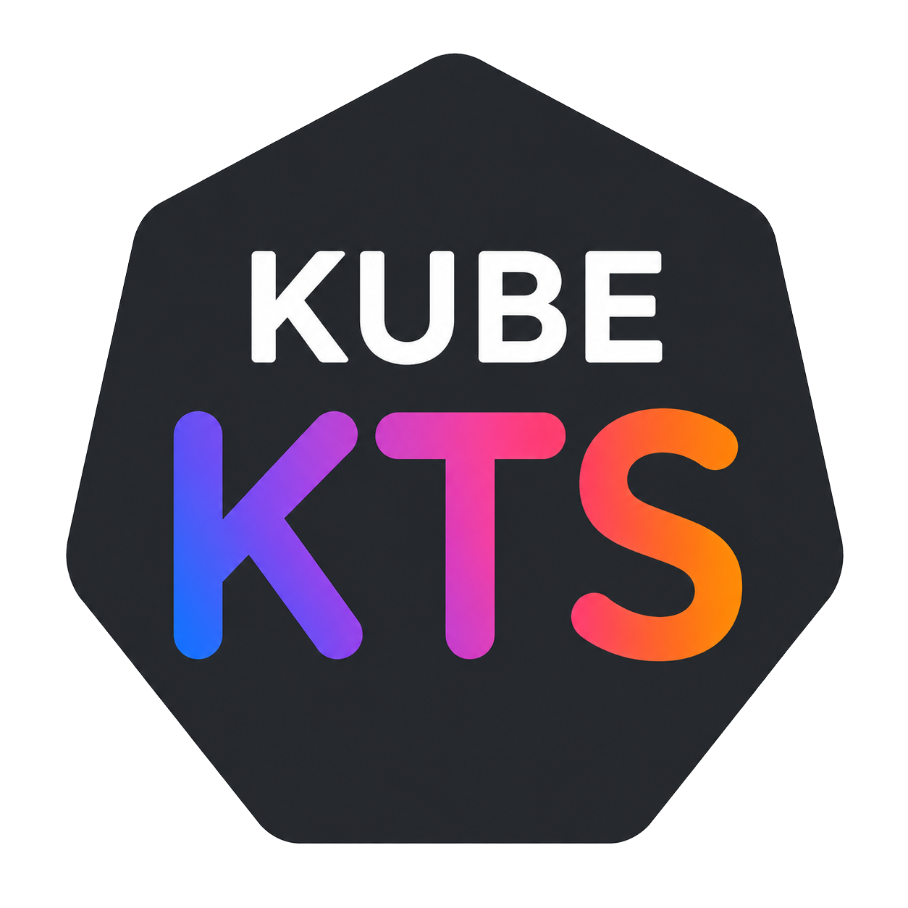

  

# Kube KTS

Kube KTS is a powerful wrapper for Helm that allows you to transition from traditional Go-templating to **Kotlin Scripts (KTS)**.

---

**"Work in Progress"**
    
This project is a work in progress. Comprehensive documentation is available via [MK Docs](https://kleinerhacker.github.io/kube-kts/).

---

## Overview

### Motivation

Traditional Helm Go-Templates often break the YAML structure, making them difficult to read, maintain, and debug. By leveraging Kotlin Scripts (KTS), similar to Gradle, you benefit from a declarative "look and feel" while retaining the full programmatic power of Kotlin. 

Key advantages include:
- **Type Safety:** Catch errors during compilation rather than at runtime.
- **Validation:** Built-in validation during rendering.
- **Readability:** Maintain clean YAML structures without template logic interference.

### Structure

Kube KTS integrates seamlessly with your existing Helm workflows. You maintain a standard `helm` directory, but instead of writing `.yaml` templates, you use Kotlin Script files. The tool compiles and renders these into 100% Helm-compatible YAML files.

#### Legacy Support

Kube KTS fully supports classic Helm Go-templates. Files with `.yaml` or `.yml` extensions are processed as traditional templates, and all other file types are preserved and copied to the output.

### Values

The `values.yaml` file remains the central place for configuration. Multiple value files can be combined into a single map, just as in Helm.

In KTS, the root `values` key is handled automatically. For complex objects, lambda functions allow you to easily scope and access nested configuration nodes.

## CLI

Kube KTS ships as the `kube-kts` command. It first renders your KTS repository to a plain Helm chart
and then delegates to Helm for the actual cluster operations.

| Command | Description |
|---|---|
| `validate <repo>` | Validate a repository (structure only). |
| `compile <repo>` | Compile and evaluate the KTS scripts. |
| `render <repo> [target]` | Render the repository to a plain Helm chart. |
| `lint <repo> [target]` | Render and run `helm lint`. |
| `template <repo> [target] --name <name>` | Render and run `helm template`. |
| `install <repo> [target] --name <name>` | Render and run `helm install`. |
| `upgrade <repo> [target] --name <name>` | Render and run `helm upgrade` (use `-i` to install if missing). |
| `uninstall <repo> [target] --name <release>` | Render and run `helm uninstall`. |

The Helm-backed commands (`lint`, `template`, `install`, `uninstall`) forward **all** supported Helm
flags — global flags (`--namespace`, `--kube-context`, …), value flags (`--set`, `-f`, …),
chart-source and rendering flags. In `--help` a dedicated column marks each option: `---->` forwarded
to Helm, `*` experimental, `!!!` dangerous/security-relevant. See
[HELM_SUPPORT.md](HELM_SUPPORT.md) for the current Helm coverage.

> The release name is passed via `--name`; `-n` is reserved for `--namespace` to match Helm.

---

For more details, visit the [official documentation](https://kleinerhacker.github.io/kube-kts/)
(available in English, 简体中文, 日本語 and 한국어) or the
[API Doc](https://kleinerhacker.github.io/kube-kts/dokka/html).

For licence information see [here](https://kleinerhacker.github.io/kube-kts/licences).