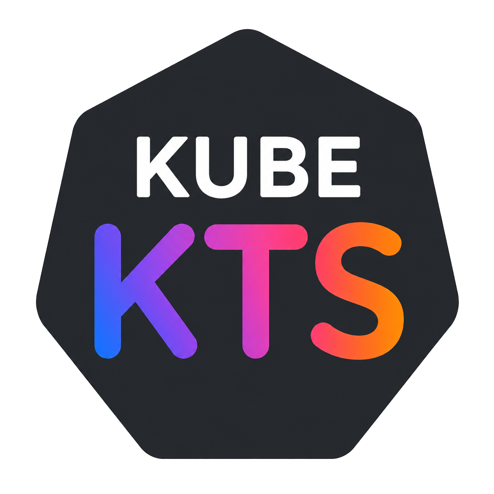

<p align="center">
  
</p>

# Kube KTS

Kube KTS is a powerful wrapper for Helm that allows you to transition from traditional Go-templating to **Kotlin
Scripts (KTS)**.

---

**"Work in Progress"**

This project is a work in progress. Comprehensive documentation is available
via [MK Docs](https://kleinerhacker.github.io/kube-kts/).

---

## Overview

### Motivation

Traditional Helm Go-Templates often break the YAML structure, making them difficult to read, maintain, and debug. By
leveraging Kotlin Scripts (KTS), similar to Gradle, you benefit from a declarative "look and feel" while retaining the
full programmatic power of Kotlin.

Key advantages include:

- **Type Safety:** Catch errors during compilation rather than at runtime.
- **Validation:** Built-in validation during rendering.
- **Readability:** Maintain clean YAML structures without template logic interference.

### Structure

Kube KTS integrates seamlessly with your existing Helm workflows. You maintain a standard `helm` directory, but instead
of writing `.yaml` templates, you use Kotlin Script files. The tool compiles and renders these into 100% Helm-compatible
YAML files.

#### Legacy Support

Kube KTS fully supports classic Helm Go-templates. Files with `.yaml` or `.yml` extensions are processed as traditional
templates, and all other file types are preserved and copied to the output.

### Repository layout

A repository is a normal Helm chart directory named `helm/`. Recognised file types:

| Pattern                      | Meaning                                                                                      |
|------------------------------|----------------------------------------------------------------------------------------------|
| `*.spec.kts`                 | Template script — one Kubernetes resource (or `Chart.spec.kts` for the chart metadata).      |
| `*.kts`                      | Same as `*.spec.kts` (legacy naming, still supported).                                       |
| `*.lib.kts`                  | Library script — shared Kotlin functions, automatically visible in all spec scripts.         |
| `*.yaml` / `*.yml` / `*.tpl` | Classic Helm files — passed through as Go-templates (see [Legacy Support](#legacy-support)). |
| anything else                | Copied verbatim to the output.                                                               |

Mixed repositories (KTS + classic Helm files side by side) are fully supported. Rendering produces a standard chart:
`Chart.yaml`, `values.yaml` and `templates/…`.

### Values

The `values.yaml` file remains the central place for configuration. Multiple value files can be combined into a single
map, just as in Helm.

In KTS, the root `values` key is handled automatically. For complex objects, lambda functions allow you to easily scope
and access nested configuration nodes.

The typed value API offers `value`/`valueOrNull`, `array`/`arrayOrNull`, `map`/`mapOrNull` and
`exists` — each either returning a converted value (`String`, `Int`, `Long`, `Double`, `Short`,
`Float`, `Byte`, `Boolean`) or scoping into a nested object via a lambda. Merging of multiple value files uses Helm's
own algorithm by default; with `--experimental` it can be switched via
`--yaml-merge` (`HELM` / `INTERNAL`) and `--yaml-array-merge`
(`None` / `Replace` / `AddFirst` / `AddLast`).

### Script safety

Spec scripts may not use `import` statements or fully qualified class names; only the provided DSL is available. This
keeps templates declarative and reviewable. The restriction can be lifted with the dangerous `--unsafe` flag.

## Getting Started

### Prerequisites

| Requirement          | Notes                                                                                    |
|----------------------|------------------------------------------------------------------------------------------|
| JDK 25               | The Gradle toolchain resolves it automatically (foojay resolver) if it is not installed. |
| Git                  | To check out the repository.                                                             |
| `helm` on the `PATH` | Required at runtime for every Helm-backed command and for the integration tests.         |
| Python 3             | Only required to build the MkDocs documentation.                                         |
| `helm diff` plugin   | Only required for `diff upgrade`.                                                        |

### Check out and build

```bash
git clone https://github.com/KleinerHacker/kube-kts.git
cd kube-kts
./gradlew build
```

On Windows use `gradlew.bat` instead of `./gradlew`.

### Run the tests

Tests are split into two categories, distinguished by the class name suffix:

| Task                        | Contains                                                               | Class name |
|-----------------------------|------------------------------------------------------------------------|------------|
| `./gradlew developerTest`   | Unit tests without external tooling.                                   | `*Test`    |
| `./gradlew integrationTest` | Complete features, running the whole scan → compile → render pipeline. | `*IT`      |
| `./gradlew test`            | Both categories.                                                       | —          |

Code coverage is measured with [Kover](https://github.com/Kotlin/kotlinx-kover); the aggregated report is created with
`./gradlew koverHtmlReport` and written to `build/reports/kover`.

### Run the CLI

The build produces a runnable JAR in `apps/cli/build/libs`:

```bash
./gradlew :apps:cli:build
java -jar apps/cli/build/libs/kube-kts-<version>.jar render ./helm ./build/helm
java -jar apps/cli/build/libs/kube-kts-<version>.jar --help
```

### Build the documentation

```bash
./gradlew buildDocs   # builds the MkDocs site into build/docs (strict mode)
./gradlew runDocs     # serves the site locally and opens the browser
```

## Consuming the artifacts

### CLI

The `kube-kts` CLI is published as a runnable JAR with every tagged release. Download
`kube-kts-<version>.jar` from the
[GitHub releases](https://github.com/KleinerHacker/kube-kts/releases) and run it with
`java -jar`. A `helm` binary must be available on the `PATH`.

### Libraries

The modules are built as plain JARs (`libs/*/build/libs`) using the group `org.pcsoft.tooling`:

| Module            | Artifact                                                                |
|-------------------|-------------------------------------------------------------------------|
| `libs/api`        | `kube-kts-api` — the KTS DSL, needed to write and compile spec scripts. |
| `libs/definition` | `kube-kts-definition` — the script definitions for IntelliJ.            |
| `libs/core`       | `kube-kts-core` — scanner, script processor, renderer, YAML merging.    |
| `libs/logging`    | `kube-kts-logging` — console logging and output styling.                |

> The libraries are not published to a Maven repository yet. Until then, consume them either by
> including this repository as a
> [composite build](https://docs.gradle.org/current/userguide/composite_builds.html)
> (`includeBuild("../kube-kts")`) or by adding the built JARs as a flat-dir/file dependency.

## Supported Templates

Every template is written as a typed Kotlin DSL function. Anything not covered by the DSL can still be written as a
classic Go-template `.yaml`/`.yml` file (see [Legacy Support](#legacy-support)).

| DSL function         | Kind           | API version                         |
|----------------------|----------------|-------------------------------------|
| `configMap { … }`    | `ConfigMap`    | `v1`                                |
| `secret { … }`       | `Secret`       | `v1`                                |
| `sealedSecret { … }` | `SealedSecret` | `bitnami.com/v1alpha1`              |
| `service { … }`      | `Service`      | `v1`                                |
| `deployment { … }`   | `Deployment`   | `apps/v1`                           |
| `statefulSet { … }`  | `StatefulSet`  | `apps/v1`                           |
| `job { … }`          | `Job`          | `batch/v1`                          |
| `ingress { … }`      | `Ingress`      | `networking.k8s.io/v1`              |
| `route { … }`        | `Route`        | `route.openshift.io/v1` (OpenShift) |

In addition, `chart(name, version) { … }` describes the `Chart.yaml` (dependencies, maintainers, keywords, sources,
annotations, `kubeVersion`).

Each template takes a `metadata(name) { … }` block and a `spec { … }` block. The metadata supports
`namespace`, `generateName`, `clusterName`, labels, annotations, finalizers and owner references.

`ConfigMap` and `Secret` are rendered flat — their content ends up directly at the root of the document (`data`,
`binaryData`, `stringData`, `immutable`, …) instead of below a `spec` node. All other templates are rendered with an
explicit `spec` node.

The specs share reusable sub-DSLs, among them:

- **Pod/Container:** `pod`, `container`, ports (incl. `hostPort`/`hostIP`), environment (single values and complete
  sources such as ConfigMaps/Secrets), `probe` (liveness/readiness/startup), `lifecycle`,
  `securityContext`, hardware resources (requests/limits/claims), in-place `resizePolicy`, native sidecars via
  `restartPolicy`
- **Scheduling:** `affinity` (incl. affinity terms), `toleration`, `topologySpreadConstraint`,
  `labelSelector`, `schedulingGates`
- **Storage:** `volume` with every Kubernetes volume source, volume mounts (incl. `subPath` and mount propagation),
  `volumeClaimTemplate`, `persistentVolumeClaimRetentionPolicy`
- **Rollout:** deployment strategy, StatefulSet update strategy
- **Job control:** pod failure policy, success policy, `managedBy`
- **Networking:** rules/backends, `tls`, route target and route TLS, port mappings, protocols

Ports that Kubernetes models as `IntOrString` accept both forms: `httpGet(8080)` and `httpGet("http")`,
`targetPort` and `targetPortName`.

### Volume Sources

`volume(name) { from { … } }` covers the complete set of Kubernetes volume sources:

| Group      | Sources                                                                                                      |
|------------|--------------------------------------------------------------------------------------------------------------|
| Config     | `configMap`, `secret`, `projected`, `downwardApi`                                                            |
| Node-local | `emptyDir`, `hostPath`, `persistentVolumeClaim`, `ephemeral`, `image`, `csi`                                 |
| Network    | `nfs`, `iscsi`, `fibreChannel`, `rbd`, `cephFs`, `glusterFs`                                                 |
| Cloud      | `awsElasticBlockStore`, `gcePersistentDisk`, `azureDisk`, `azureFile`, `cinder`, `portworx`, `vsphereVolume` |

Sources that Kubernetes has removed (`gitRepo`, `flexVolume`, `flocker`, `quobyte`, `scaleIo`,
`storageOs`, `photonPersistentDisk`) remain available for older clusters but are marked deprecated.

## CLI

Kube KTS ships as the `kube-kts` command. It first renders your KTS repository to a plain Helm chart and then delegates
to Helm for the actual cluster operations.

### Repository-based commands (KTS is rendered first)

These commands run the *scan → compile → render* pipeline and therefore require a repository.

| Command                                                    | Description                                                                       |
|------------------------------------------------------------|-----------------------------------------------------------------------------------|
| `validate <repo>`                                          | Validate a repository (structure only).                                           |
| `compile <repo>`                                           | Compile and evaluate the KTS scripts.                                             |
| `render <repo> [target]`                                   | Render the repository to a plain Helm chart.                                      |
| `lint <repo> [target]`                                     | Render and run `helm lint`.                                                       |
| `template <repo> [target] --name <name>`                   | Render and run `helm template`.                                                   |
| `install <repo> [target] --name <name>`                    | Render and run `helm install`.                                                    |
| `upgrade <repo> [target] --name <name>`                    | Render and run `helm upgrade` (use `-i` to install if missing).                   |
| `uninstall <repo> [target] --name <release>`               | Render and run `helm uninstall`.                                                  |
| `package <repo> [target]`                                  | Render and run `helm package` (`.tgz`).                                           |
| `dependency` / `dep` `build\|update\|list <repo> [target]` | Render and run `helm dependency <sub>` (aliases: `update` → `up`, `list` → `ls`). |
| `diff upgrade <repo> [target] --name <release>`            | Render and run `helm diff upgrade` (requires the **helm-diff** plugin).           |

### Direct commands (no repository, no rendering)

These operate on an existing release, a repository/registry or are purely informational, so the KTS scripts are
irrelevant — arguments are passed straight through to Helm.

| Command                                                       | Description                                                                                        |
|---------------------------------------------------------------|----------------------------------------------------------------------------------------------------|
| `status <release>`                                            | `helm status` (`--revision`, `--show-resources`, …).                                               |
| `list` / `ls`                                                 | `helm list` (`-a`, `-A`, `--deployed`/`--failed`/…, `-o`, `-l`).                                   |
| `history` / `hist <release>`                                  | `helm history` (`--max`, `-o`).                                                                    |
| `rollback <release> [revision]`                               | `helm rollback` (`--force`, `--wait`, `--cleanup-on-fail`, …).                                     |
| `test <release>`                                              | `helm test` (`--filter`, `--logs`, `--timeout`).                                                   |
| `get all\|values\|manifest\|hooks\|notes\|metadata <release>` | `helm get <sub>`.                                                                                  |
| `repo add\|update\|list\|remove`                              | `helm repo <sub>` incl. auth/TLS flags (aliases: `update` → `up`, `list` → `ls`, `remove` → `rm`). |
| `search repo\|hub [keyword]`                                  | `helm search <sub>`.                                                                               |
| `registry login\|logout <host>`                               | `helm registry <sub>`.                                                                             |
| `show` / `inspect` `all\|chart\|values\|readme\|crds <chart>` | `helm show <sub>` (`show values` also supports `--jsonpath`).                                      |
| `pull` / `fetch <chart>`                                      | `helm pull` (`-d`, `--prov`, `--untar`).                                                           |
| `push <chart> <remote>`                                       | `helm push`.                                                                                       |
| `verify <path>`                                               | `helm verify` (`--keyring`).                                                                       |
| `version`                                                     | `helm version` (`--short`, `--template`).                                                          |
| `env [name]`                                                  | `helm env`.                                                                                        |

All Helm-backed commands forward **all** supported Helm flags — global flags (`--namespace`,
`--kube-context`, `--kubeconfig`, …), value flags (`--set`, `-f`, …), chart-source and rendering flags. In `--help` a
dedicated column marks each option: `---->` forwarded to Helm, `*` experimental,
`!!!` dangerous/security-relevant.

The Helm meta commands `plugin`, `completion` and `create` are intentionally **not** wrapped.

### Own flags (not forwarded to Helm)

| Flag                        | Description                                                            |
|-----------------------------|------------------------------------------------------------------------|
| `--verbose`                 | Print all information with log level.                                  |
| `--debug`                   | Print debug information (also forwarded to Helm).                      |
| `--show-log-level`          | Print the log level of information output.                             |
| `--exception`               | Print exceptions in case of errors.                                    |
| `--experimental`            | Enable experimental features (required for the YAML merge flags).      |
| `--unsafe`                  | Allow `import` and fully qualified class names in scripts (dangerous). |
| `--yaml-merge <TYPE>`       | `HELM` (default) or `INTERNAL` merge algorithm (experimental).         |
| `--yaml-array-merge <TYPE>` | `None`, `Replace` (default), `AddFirst`, `AddLast` (experimental).     |
| `--help` / `--version`      | Usage (incl. the option legend) and version information.               |

A `helm` binary must be available on the `PATH`; `diff upgrade` additionally requires the
[helm-diff](https://github.com/databus23/helm-diff) plugin.

> For repository-based commands the release name is passed via `--name` (positions 0/1 are taken by
> `<repo>`/`[target]`); `-n` is reserved for `--namespace` to match Helm. Direct commands take the
> release name as a plain positional argument.

## Project modules

| Module            | Content                                                                                   |
|-------------------|-------------------------------------------------------------------------------------------|
| `libs/api`        | The public KTS DSL — chart, templates and their specs, value access, typed value classes. |
| `libs/definition` | Kotlin script definitions for `*.spec.kts` and `*.lib.kts` (compile/eval configuration).  |
| `libs/core`       | Scanner, script processor/builder, renderer and YAML merging.                             |
| `libs/logging`    | Console logging and output styling.                                                       |
| `apps/cli`        | The `kube-kts` command including the Helm wrapper.                                        |

---

For more details, visit the [official documentation](https://kleinerhacker.github.io/kube-kts/)
(available in English, 简体中文, 日本語 and 한국어) or the
[API Doc](https://kleinerhacker.github.io/kube-kts/dokka/html).

For licence information see [here](https://kleinerhacker.github.io/kube-kts/licences).